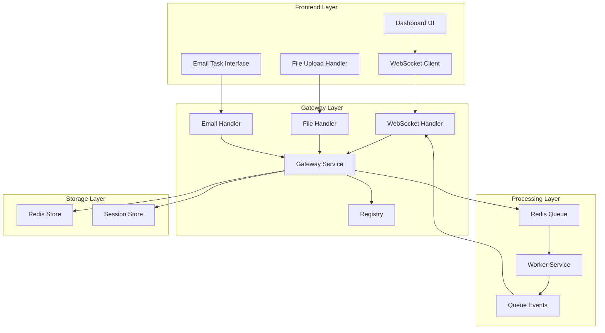
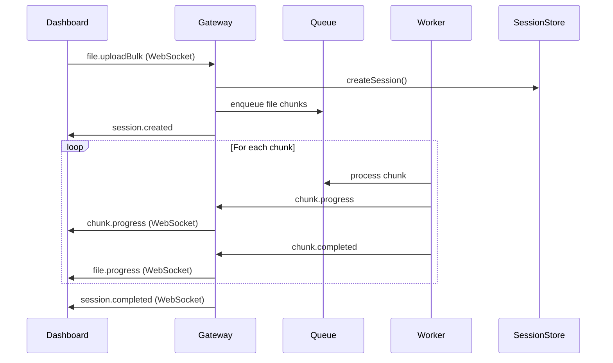
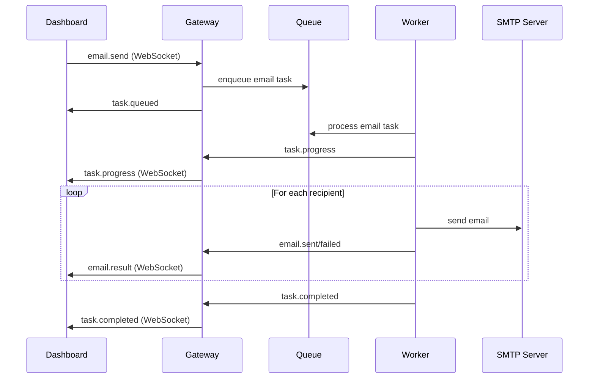

# Design Document: Async Task Dashboard

## Overview

The Async Task Dashboard is a modern, dark-themed web interface that provides comprehensive real-time monitoring and management capabilities for asynchronous task processing. Built on top of the existing gateway and worker services, it delivers a unified dashboard experience with WebSocket-based real-time updates, multi-format file upload handling, email task management, and live system observability.

The dashboard serves as the primary user interface for the async task processing system, transforming the current basic HTML interface into a professional, feature-rich monitoring and control center. It maintains backward compatibility with existing WebSocket protocols while introducing enhanced UI components and real-time feedback mechanisms.

## Architecture

### System Components

The dashboard architecture builds upon the existing three-tier system:



### Communication Flow

1. **WebSocket Connection**: Dashboard establishes authenticated WebSocket connection to gateway
2. **Task Submission**: File uploads and email tasks are submitted via WebSocket JSON-RPC
3. **Queue Processing**: Gateway enqueues tasks to Redis, workers process them asynchronously
4. **Real-time Updates**: Queue events are forwarded to dashboard via WebSocket for live feedback
5. **State Management**: Session store tracks file processing state, registry manages client connections

### Technology Stack

- **Frontend**: Vanilla JavaScript with WebSocket API, CSS Grid/Flexbox
- **Backend**: Existing Bun.js gateway with BullMQ queue system
- **Real-time**: WebSocket with JSON-RPC protocol
- **Storage**: Redis for queue and session management
- **Styling**: Custom CSS with dark theme and neon accents

## Components and Interfaces

### Dashboard Core Components

#### WebSocketManager
Handles connection lifecycle and message routing:

```typescript
interface WebSocketManager {
  connect(token: string): Promise<void>
  disconnect(): void
  send(message: JSONRPCMessage): void
  onMessage(handler: (message: any) => void): void
  getConnectionStatus(): ConnectionStatus
}

interface ConnectionStatus {
  connected: boolean
  serverUrl: string
  lastPing: Date | null
  reconnectAttempts: number
}
```

#### FileUploadHandler
Manages multi-format file upload and processing:

```typescript
interface FileUploadHandler {
  addFiles(files: File[]): void
  removeFile(index: number): void
  clearFiles(): void
  uploadFiles(): Promise<void>
  getSupportedFormats(): string[]
  getSelectedFiles(): FileDescriptor[]
}

interface FileDescriptor {
  filename: string
  mimeType: string
  size: number
  data: string // base64 encoded
}
```

#### EmailTaskManager
Handles email composition and task queuing:

```typescript
interface EmailTaskManager {
  addRecipients(emails: string[]): void
  removeRecipient(index: number): void
  setSubject(subject: string): void
  setBody(body: string): void
  queueEmailTask(): Promise<void>
  validateEmail(email: string): boolean
  getRecipientCount(): number
}
```

#### TaskStatusTracker
Tracks real-time task metrics and progress:

```typescript
interface TaskStatusTracker {
  updateMetrics(metrics: SystemMetrics): void
  updateTaskProgress(taskId: string, progress: TaskProgress): void
  getOverallProgress(): ProgressSummary
  getTaskById(taskId: string): TaskStatus | null
}

interface SystemMetrics {
  totalTasks: number
  processing: number
  success: number
  failed: number
  queueSize: number
  activeWorkers: number
  startTime: Date
}

interface TaskProgress {
  taskId: string
  status: 'pending' | 'processing' | 'completed' | 'failed'
  progress: number
  result?: any
  error?: string
}
```

#### LiveLogger
Manages real-time event logging with color coding:

```typescript
interface LiveLogger {
  logConnection(event: ConnectionEvent): void
  logTask(event: TaskEvent): void
  logWorker(event: WorkerEvent): void
  logEmail(event: EmailEvent): void
  logError(event: ErrorEvent): void
  clearLogs(): void
  getLogHistory(): LogEntry[]
}

interface LogEntry {
  timestamp: Date
  level: 'info' | 'success' | 'warning' | 'error'
  message: string
  category: 'connection' | 'task' | 'worker' | 'email' | 'system'
}
```

### UI Component Structure

#### Layout Components

```typescript
interface DashboardLayout {
  header: HeaderComponent
  connectionPanel: WebSocketPanel
  fileUploadSection: FileUploadSection
  emailTaskSection: EmailTaskSection
  metricsPanel: MetricsPanel
  progressPanel: ProgressPanel
  logsPanel: LogsPanel
}

interface WebSocketPanel {
  connectionStatus: StatusIndicator
  serverUrl: DisplayField
  connectButton: ActionButton
  disconnectButton: ActionButton
}

interface FileUploadSection {
  dropZone: DragDropZone
  fileList: FileListDisplay
  uploadButton: ActionButton
  clearButton: ActionButton
  formatSupport: FormatIndicator[]
}

interface EmailTaskSection {
  fromField: ReadOnlyField
  recipientsInput: MultiEmailInput
  subjectInput: TextInput
  bodyInput: TextAreaInput
  queueButton: ActionButton
  recipientCount: CountDisplay
}
```

### WebSocket Protocol Extensions

The dashboard extends the existing JSON-RPC protocol with new message types:

```typescript
// Dashboard-specific message types
interface DashboardMessages {
  'dashboard.getMetrics': { method: 'dashboard.getMetrics' }
  'dashboard.subscribe': { method: 'dashboard.subscribe', params: { events: string[] } }
  'dashboard.unsubscribe': { method: 'dashboard.unsubscribe', params: { events: string[] } }
}

// Real-time event notifications
interface EventNotifications {
  'metrics.updated': { method: 'metrics.updated', params: SystemMetrics }
  'task.statusChanged': { method: 'task.statusChanged', params: TaskProgress }
  'worker.activity': { method: 'worker.activity', params: WorkerActivity }
  'system.alert': { method: 'system.alert', params: SystemAlert }
}
```

## Data Models

### Task Processing Models

```typescript
interface TaskSession {
  sessionId: string
  userId: string
  startTime: Date
  totalFiles: number
  completedFiles: number
  failedFiles: number
  status: 'active' | 'completed' | 'failed'
}

interface FileTask {
  fileId: string
  sessionId: string
  filename: string
  mimeType: string
  size: number
  status: 'pending' | 'processing' | 'completed' | 'failed'
  progress: number
  chunkCount: number
  processedChunks: number
  startTime?: Date
  endTime?: Date
  error?: string
}

interface EmailTask {
  taskId: string
  subject: string
  body: string
  recipients: EmailRecipient[]
  status: 'queued' | 'processing' | 'completed' | 'failed'
  queuedAt: Date
  processedAt?: Date
  totalSent: number
  totalFailed: number
}

interface EmailRecipient {
  email: string
  status: 'pending' | 'sent' | 'failed'
  error?: string
  sentAt?: Date
}
```

### UI State Models

```typescript
interface DashboardState {
  connection: ConnectionState
  files: FileUploadState
  email: EmailTaskState
  metrics: MetricsState
  logs: LogsState
  theme: ThemeState
}

interface ConnectionState {
  status: 'disconnected' | 'connecting' | 'connected' | 'error'
  serverUrl: string
  token: string
  lastConnected?: Date
  reconnectAttempts: number
}

interface FileUploadState {
  selectedFiles: File[]
  uploadProgress: Map<string, number>
  processingFiles: Map<string, FileTask>
  supportedFormats: string[]
  maxFiles: number
}

interface EmailTaskState {
  recipients: string[]
  subject: string
  body: string
  fromAddress: string
  activeTask?: EmailTask
  taskHistory: EmailTask[]
}

interface MetricsState {
  current: SystemMetrics
  history: MetricsSnapshot[]
  overallProgress: number
  lastUpdated: Date
}

interface LogsState {
  entries: LogEntry[]
  maxEntries: number
  filters: LogFilter[]
  autoScroll: boolean
}
```

## Data Models

### File Processing Data Flow



### Email Task Data Flow


## Correctness Properties

*A property is a characteristic or behavior that should hold true across all valid executions of a system-essentially, a formal statement about what the system should do. Properties serve as the bridge between human-readable specifications and machine-verifiable correctness guarantees.*
