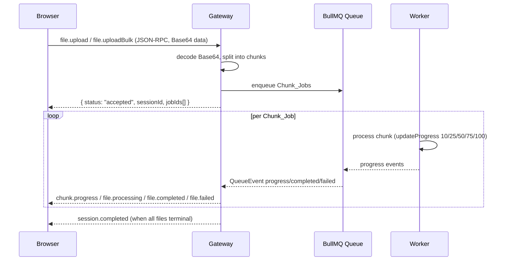
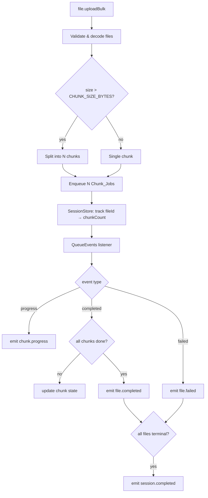

# Design Document: Bulk File Processing

## Overview

This feature extends the existing Real-Time Async Service Backend to support large file and bulk file processing. Files arrive over the existing authenticated WebSocket connection as JSON-RPC 2.0 messages, are split into chunks when large, queued via BullMQ, processed by workers with configurable concurrency (default 5), and real-time progress is streamed back per-chunk and per-file.

The design builds directly on top of the existing stack:
- Gateway (`apps/gateway/index.ts`): Bun.serve() on port 4000, WebSocket with JWT auth
- Worker (`apps/worker/index.ts`): BullMQ Worker on the `jobs` queue
- Queue event handlers (`apps/gateway/queue-event-handlers.ts`): progress/completed/failed routing
- Client registry (`apps/gateway/registry.ts`): `Map<jobId, ws>`

Key design decisions:
- **No new transport**: files are sent as Base64 in the existing JSON-RPC WebSocket messages, avoiding a separate HTTP upload endpoint
- **Chunk-level parallelism**: large files are split into `CHUNK_SIZE_BYTES`-sized chunks, each enqueued as an independent BullMQ job
- **Session state in-memory**: a `SessionStore` (in-process Map) tracks bulk session and file state; this is sufficient for a single-process gateway
- **Aggregation in gateway**: the gateway listens to QueueEvents and aggregates chunk completions to emit file-level and session-level notifications
- **Sequence numbers**: every session-scoped notification carries a monotonically increasing `seq` field for out-of-order detection

---

## Architecture





---

## Components and Interfaces

### New JSON-RPC Methods (Gateway inbound)

| Method | Direction | Description |
|---|---|---|
| `file.upload` | Client → Gateway | Upload a single file |
| `file.uploadBulk` | Client → Gateway | Upload up to 500 files |
| `file.retry` | Client → Gateway | Re-enqueue a failed file |
| `session.status` | Client → Gateway | Get current session snapshot |

### New JSON-RPC Notifications (Gateway outbound)

| Method | Direction | Description |
|---|---|---|
| `file.processing` | Gateway → Client | File has started processing |
| `file.completed` | Gateway → Client | File fully processed |
| `file.failed` | Gateway → Client | File failed after retries |
| `chunk.progress` | Gateway → Client | Per-chunk progress update |
| `session.completed` | Gateway → Client | All files in session terminal |

### New Modules

**`apps/gateway/session-store.ts`**
Manages in-memory state for bulk sessions and files.

```typescript
interface ChunkState {
  chunkIndex: number;
  status: "pending" | "processing" | "completed" | "failed";
  result?: any;
  error?: string;
}

interface FileState {
  fileId: string;
  filename: string;
  mimeType: string;
  chunkCount: number;
  chunks: Map<number, ChunkState>;
  status: "pending" | "processing" | "completed" | "failed";
  result?: any;
  error?: string;
  failedChunkIndex?: number;
  jobIds: string[]; // one per chunk
}

interface SessionState {
  sessionId: string;
  ws: any; // WebSocket reference
  files: Map<string, FileState>;
  totalCount: number;
  completedCount: number;
  failedCount: number;
  startedAt: number; // Date.now()
  seq: number; // monotonically increasing per session
}

class SessionStore {
  createSession(ws: any): SessionState;
  getSession(sessionId: string): SessionState | undefined;
  addFile(sessionId: string, file: Omit<FileState, "chunks" | "status">): FileState;
  getFileByJobId(jobId: string): { session: SessionState; file: FileState; chunkIndex: number } | undefined;
  updateChunk(jobId: string, status: ChunkState["status"], result?: any, error?: string): void;
  deleteSession(sessionId: string): void;
}
```

**`apps/gateway/file-handlers.ts`**
Handles `file.upload`, `file.uploadBulk`, `file.retry`, `session.status` RPC dispatch.

**`apps/gateway/chunk-event-handlers.ts`**
Extends queue event handling for chunk-level events, emitting `chunk.progress`, `file.processing`, `file.completed`, `file.failed`, `session.completed`.

**`apps/worker/index.ts`** (modified)
Worker processor updated to handle `file.processChunk` job type alongside existing jobs. Concurrency raised to `WORKER_CONCURRENCY` env var (default 5).

### Modified Files

| File | Change |
|---|---|
| `apps/gateway/index.ts` | Route `file.*` and `session.*` RPC methods to file-handlers; wire chunk-event-handlers to QueueEvents |
| `apps/worker/index.ts` | Add `file.processChunk` job handler; set concurrency from env |
| `apps/gateway/registry.ts` | No change (jobId → ws mapping reused as-is) |
| `apps/gateway/queue-event-handlers.ts` | Existing handlers unchanged; chunk handlers added separately |

---

## Data Models

### Inbound: `file.upload`

```typescript
{
  jsonrpc: "2.0",
  method: "file.upload",
  id: number,
  params: {
    filename: string;      // e.g. "report.pdf"
    mimeType: string;      // e.g. "application/pdf"
    size: number;          // byte count of decoded content
    data: string;          // Base64-encoded file bytes
  }
}
```

Response (success):
```typescript
{ jsonrpc: "2.0", result: { status: "accepted", sessionId: string }, id: number }
```

Response (error):
```typescript
{ jsonrpc: "2.0", error: { code: -32602, message: string }, id: number }
```

### Inbound: `file.uploadBulk`

```typescript
{
  jsonrpc: "2.0",
  method: "file.uploadBulk",
  id: number,
  params: {
    files: Array<{ filename: string; mimeType: string; size: number; data: string }>
  }
}
```

Response (success):
```typescript
{
  jsonrpc: "2.0",
  result: {
    status: "accepted",
    sessionId: string,
    fileCount: number,
    jobIds: string[]
  },
  id: number
}
```

### Inbound: `file.retry`

```typescript
{
  jsonrpc: "2.0",
  method: "file.retry",
  id: number,
  params: { sessionId: string; fileId: string }
}
```

Response (success):
```typescript
{ jsonrpc: "2.0", result: { status: "requeued", jobId: string }, id: number }
```

### Inbound: `session.status`

```typescript
{
  jsonrpc: "2.0",
  method: "session.status",
  id: number,
  params: { sessionId: string }
}
```

Response:
```typescript
{
  jsonrpc: "2.0",
  result: {
    sessionId: string,
    totalCount: number,
    completedCount: number,
    failedCount: number,
    files: Array<{
      fileId: string,
      filename: string,
      status: "pending" | "processing" | "completed" | "failed",
      chunkCount: number,
      chunksCompleted: number
    }>
  },
  id: number
}
```

### Outbound Notifications

```typescript
// chunk.progress
{ jsonrpc: "2.0", method: "chunk.progress", params: { sessionId, fileId, filename, chunkIndex, chunkCount, progress, seq } }

// file.processing
{ jsonrpc: "2.0", method: "file.processing", params: { sessionId, fileId, filename, seq } }

// file.completed
{ jsonrpc: "2.0", method: "file.completed", params: { sessionId, fileId, filename, result, completedCount, totalCount, seq } }

// file.failed
{ jsonrpc: "2.0", method: "file.failed", params: { sessionId, fileId, filename, error, failedChunkIndex, totalCount, seq } }

// session.completed
{ jsonrpc: "2.0", method: "session.completed", params: { sessionId, totalCount, completedCount, failedCount, durationMs, seq } }
```

### BullMQ Job Data: `file.processChunk`

```typescript
{
  method: "file.processChunk",
  sessionId: string,
  fileId: string,
  filename: string,
  mimeType: string,
  chunkIndex: number,
  chunkCount: number,
  data: string  // Base64-encoded chunk bytes
}
```

### Environment Variables

| Variable | Default | Description |
|---|---|---|
| `CHUNK_SIZE_BYTES` | `1048576` (1 MB) | Maximum bytes per chunk |
| `MAX_FILE_SIZE_BYTES` | `104857600` (100 MB) | Maximum total file size |
| `WORKER_CONCURRENCY` | `5` | Number of concurrent BullMQ jobs |

---


## Correctness Properties

*A property is a characteristic or behavior that should hold true across all valid executions of a system — essentially, a formal statement about what the system should do. Properties serve as the bridge between human-readable specifications and machine-verifiable correctness guarantees.*

### Property 1: Base64 decode round-trip

*For any* valid file upload message with Base64-encoded `data`, decoding the `data` field and re-encoding it should produce the original Base64 string, and the decoded byte length should equal the `size` field.

**Validates: Requirements 1.1**

---

### Property 2: Invalid Base64 yields error -32602

*For any* `file.upload` message where `data` is missing or is not valid Base64, the gateway response should be a JSON-RPC 2.0 error with `code: -32602` and `message: "Invalid file payload"`.

**Validates: Requirements 1.2**

---

### Property 3: Oversized file yields error -32602

*For any* `file.upload` message where the decoded file size exceeds `MAX_FILE_SIZE_BYTES`, the gateway response should be a JSON-RPC 2.0 error with `code: -32602` and `message: "File exceeds maximum allowed size"`.

**Validates: Requirements 1.3**

---

### Property 4: Accepted response shape

*For any* valid `file.upload` or `file.uploadBulk` message, the gateway response should contain `status: "accepted"` and a non-empty `sessionId` string.

**Validates: Requirements 1.4, 3.4**

---

### Property 5: Chunking invariants

*For any* file of arbitrary byte size and any `CHUNK_SIZE_BYTES` value, the chunking function should produce chunks where: (a) every chunk's byte length is ≤ `CHUNK_SIZE_BYTES`, (b) chunk indices are exactly `0..chunkCount-1`, (c) concatenating all chunks in index order reconstructs the original file bytes exactly, and (d) a file ≤ `CHUNK_SIZE_BYTES` produces exactly one chunk with `chunkIndex: 0`.

**Validates: Requirements 2.1, 2.2, 2.3, 2.4**

---

### Property 6: Bulk limit enforcement

*For any* `file.uploadBulk` message, if the `files` array length is ≤ 500 the request should be accepted; if the length is > 500 the response should be a JSON-RPC 2.0 error with `code: -32602` and `message: "Bulk limit exceeded"`.

**Validates: Requirements 3.1, 3.2**

---

### Property 7: Session and file ID uniqueness

*For any* two independently created sessions, their `sessionId` values should differ. *For any* bulk session, all `fileId` values within that session should be distinct.

**Validates: Requirements 3.3**

---

### Property 8: Registry round-trip

*For any* set of enqueued chunk jobs, looking up each `jobId` in the `clientRegistry` should return the WebSocket that submitted the request.

**Validates: Requirements 3.5**

---

### Property 9: Worker progress sequence

*For any* `file.processChunk` job, the sequence of `updateProgress` calls should be exactly `[10, 25, 50, 75, 100]` in that order.

**Validates: Requirements 4.1, 4.2, 4.3**

---

### Property 10: chunk.progress notification shape

*For any* progress QueueEvent received for a registered Chunk_Job, the WebSocket should receive a JSON-RPC 2.0 notification with `method: "chunk.progress"` and params containing `sessionId`, `fileId`, `filename`, `chunkIndex`, `chunkCount`, `progress`, and `seq`.

**Validates: Requirements 4.4**

---

### Property 11: file.completed notification shape and aggregation order

*For any* file whose all chunk jobs have completed, the `file.completed` notification should contain `sessionId`, `fileId`, `filename`, `result` (chunks aggregated in `chunkIndex` order), `completedCount`, `totalCount`, and `seq`.

**Validates: Requirements 5.1, 5.2, 6.4, 6.5**

---

### Property 12: No premature file.completed

*For any* file with at least one chunk still in `pending` or `processing` state, no `file.completed` notification should be emitted for that file.

**Validates: Requirements 5.3**

---

### Property 13: file.failed notification shape

*For any* file where at least one chunk job has exhausted all retries, the `file.failed` notification should contain `sessionId`, `fileId`, `filename`, `error`, `failedChunkIndex`, `totalCount`, and `seq`.

**Validates: Requirements 5.4, 6.5**

---

### Property 14: file.processing notification on first chunk start

*For any* chunk job that transitions to active processing, if it is the first chunk for its `fileId`, the WebSocket should receive a `file.processing` notification with `sessionId`, `fileId`, `filename`, and `seq`.

**Validates: Requirements 6.1**

---

### Property 15: session.completed on all-terminal

*For any* bulk session where all files have reached a terminal state (completed or failed), a `session.completed` notification should be emitted with `totalCount`, `completedCount`, `failedCount`, and `durationMs ≥ 0`.

**Validates: Requirements 7.1, 7.2, 7.3**

---

### Property 16: file.retry re-enqueues known files

*For any* known `sessionId` and `fileId`, a `file.retry` request should result in new chunk jobs being enqueued and a response of `{ status: "requeued", jobId }`.

**Validates: Requirements 8.1, 8.2**

---

### Property 17: file.retry unknown session/file yields error

*For any* `file.retry` request where `sessionId` or `fileId` is not found in session state, the response should be a JSON-RPC 2.0 error with `code: -32602` and `message: "Unknown session or file"`.

**Validates: Requirements 8.3**

---

### Property 18: Worker concurrency from environment

*For any* value of `WORKER_CONCURRENCY` environment variable, the BullMQ Worker should be instantiated with that concurrency value; when unset, the default should be 5.

**Validates: Requirements 9.1, 9.2**

---

### Property 19: Outbound notifications have no id field

*For any* outbound notification emitted by the gateway (`chunk.progress`, `file.processing`, `file.completed`, `file.failed`, `session.completed`), the JSON object should have `jsonrpc: "2.0"`, a `method` field, a `params` field, and no `id` field.

**Validates: Requirements 10.1**

---

### Property 20: session.status returns current snapshot

*For any* active session, calling `session.status` with its `sessionId` should return a snapshot where each file's `status`, `chunkCount`, and `chunksCompleted` accurately reflect the current state in the `SessionStore`.

**Validates: Requirements 10.2, 10.3**

---

### Property 21: seq is monotonically increasing per session

*For any* sequence of notifications emitted for the same session, the `seq` values should be strictly increasing (each notification's `seq` > the previous notification's `seq`).

**Validates: Requirements 10.4**

---

## Error Handling

| Scenario | Response |
|---|---|
| Missing or invalid Base64 `data` | JSON-RPC error `{ code: -32602, message: "Invalid file payload" }` |
| File exceeds `MAX_FILE_SIZE_BYTES` | JSON-RPC error `{ code: -32602, message: "File exceeds maximum allowed size" }` |
| Bulk array > 500 files | JSON-RPC error `{ code: -32602, message: "Bulk limit exceeded" }` |
| Unknown `sessionId` or `fileId` in retry | JSON-RPC error `{ code: -32602, message: "Unknown session or file" }` |
| Chunk job fails after all retries | `file.failed` notification; session continues for remaining files |
| No WebSocket registered for a jobId | Log orphaned event; no further action |
| WebSocket send throws | Log error; remove jobId from registry |
| Redis/BullMQ enqueue failure | JSON-RPC error `{ code: -32603, message: "Internal error" }` |

All errors use standard JSON-RPC 2.0 error format. The gateway never crashes on a per-job failure; errors are isolated to the affected file/chunk.

---

## Testing Strategy

### Dual Testing Approach

Both unit tests and property-based tests are required. They are complementary:
- Unit tests cover specific examples, integration points, and edge cases
- Property tests verify universal correctness across randomized inputs

### Property-Based Testing

**Library**: `fast-check` (TypeScript, works with Bun's test runner)

Each property test runs a minimum of 100 iterations. Tests are tagged with a comment referencing the design property.

Tag format: `// Feature: bulk-file-processing, Property N: <property_text>`

Each correctness property (1–21) maps to exactly one property-based test.

Example structure:
```typescript
import fc from "fast-check";
import { test, expect } from "bun:test";

// Feature: bulk-file-processing, Property 5: Chunking invariants
test("chunking invariants hold for any file size", () => {
  fc.assert(
    fc.property(
      fc.uint8Array({ minLength: 0, maxLength: 10_000_000 }),
      fc.integer({ min: 1, max: 1_000_000 }),
      (fileBytes, chunkSize) => {
        const chunks = splitIntoChunks(fileBytes, chunkSize);
        // (a) every chunk <= chunkSize
        expect(chunks.every(c => c.length <= chunkSize)).toBe(true);
        // (b) indices are 0..N-1
        expect(chunks.map((_, i) => i)).toEqual([...Array(chunks.length).keys()]);
        // (c) concatenation reconstructs original
        const reconstructed = Buffer.concat(chunks);
        expect(reconstructed).toEqual(Buffer.from(fileBytes));
        // (d) small file = single chunk
        if (fileBytes.length <= chunkSize) expect(chunks.length).toBe(1);
      }
    ),
    { numRuns: 100 }
  );
});
```

### Unit Tests

Unit tests focus on:
- Specific examples for each JSON-RPC method handler
- Integration between `SessionStore`, `file-handlers`, and `chunk-event-handlers`
- Edge cases: zero-file bulk session, single-chunk file, all-failed session
- Error path verification (invalid Base64, oversized file, unknown session)

### Test File Layout

```
apps/gateway/__tests__/
  file-handlers.test.ts       # unit + property tests for file.upload, file.uploadBulk, file.retry, session.status
  chunk-event-handlers.test.ts # unit + property tests for chunk.progress, file.completed, file.failed, session.completed
  session-store.test.ts       # unit + property tests for SessionStore operations

apps/worker/__tests__/
  chunk-processor.test.ts     # unit + property tests for file.processChunk job handler
```
