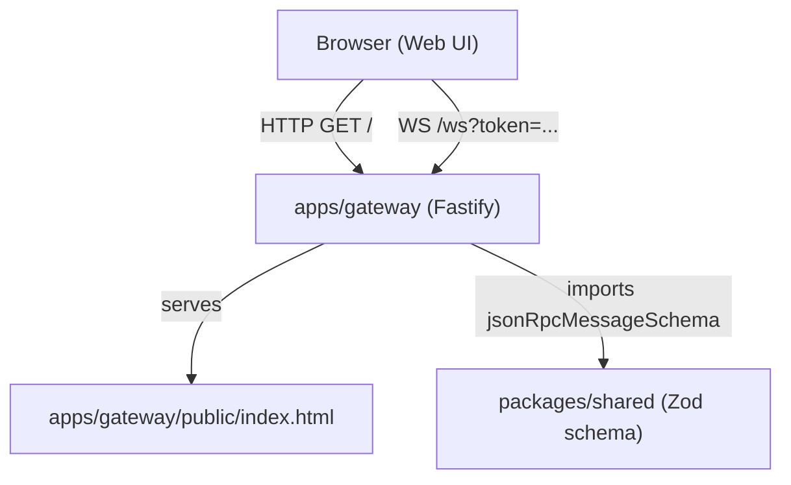
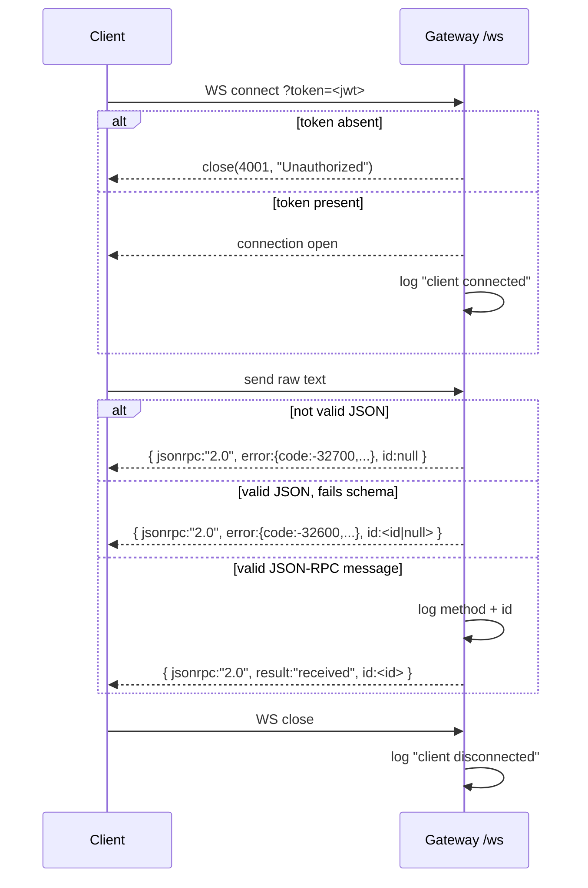

# Design Document: gateway-websocket-ui

## Overview

This feature extends the existing `apps/gateway` Fastify application with two capabilities:

1. A WebSocket endpoint (`/ws`) that authenticates clients via JWT query parameter, parses and validates JSON-RPC 2.0 messages using a shared Zod schema, and responds with acks or structured errors.
2. A static file server that serves a single-page HTML test client from `apps/gateway/public/`.

The shared Zod schema lives in `packages/shared` so it can be reused by the worker app in the future.

No new frameworks are introduced — the implementation uses the existing Bun runtime, Fastify, `@fastify/websocket`, `@fastify/static`, and Zod.

---

## Architecture



Request flow for a WebSocket message:



---

## Components and Interfaces

### 1. `packages/shared/index.ts`

Exports the shared Zod schema and inferred TypeScript type.

```typescript
// packages/shared/index.ts
import { z } from "zod";

export const jsonRpcMessageSchema = z.object({
  jsonrpc: z.literal("2.0"),
  method: z.string(),
  params: z.object({}).passthrough(),
  id: z.union([z.string(), z.number()]),
});

export type JsonRpcMessage = z.infer<typeof jsonRpcMessageSchema>;
```

### 2. `apps/gateway/index.ts`

The main Fastify server. Responsibilities:

- Register `@fastify/websocket` and `@fastify/static` plugins
- Expose `GET /` → serves `public/index.html` (handled by static plugin)
- Expose WebSocket route `GET /ws` with JWT presence check
- Parse, validate, and respond to incoming WebSocket messages
- Log connect/disconnect events

Key plugin registrations:

```typescript
await fastify.register(fastifyWebsocket);
await fastify.register(fastifyStatic, {
  root: path.join(import.meta.dir, "public"),
});
```

WebSocket route handler signature:

```typescript
fastify.get("/ws", { websocket: true }, (socket, req) => { ... });
```

### 3. `apps/gateway/public/index.html`

A self-contained HTML file (no build step). Responsibilities:

- Auto-connect to `ws://localhost:3000/ws?token=test-token` on page load
- Display connection status and server responses in an output area
- Provide a text input and "Send" button that constructs and sends a JSON-RPC message
- Show an error in the output area if send is attempted while disconnected

---

## Data Models

### JSON-RPC Message (inbound)

Defined in `packages/shared` and validated with Zod:

```typescript
{
  jsonrpc: "2.0",        // literal
  method: string,        // e.g. "data.processHeavyTask"
  params: object,        // passthrough — any key/value pairs
  id: string | number    // client-assigned request id
}
```

### JSON-RPC Ack (outbound — success)

```typescript
{
  jsonrpc: "2.0",
  result: "received",
  id: string | number    // mirrors the inbound id
}
```

### JSON-RPC Error (outbound — failure)

```typescript
{
  jsonrpc: "2.0",
  error: {
    code: -32700 | -32600,   // -32700 parse error, -32600 invalid request
    message: string
  },
  id: string | number | null  // null when id cannot be determined
}
```

### Environment Config

| Variable     | Default | Description                        |
|--------------|---------|------------------------------------|
| `PORT`       | `3000`  | Port the Fastify server listens on |
| `JWT_SECRET` | —       | Reserved for future signature validation |

---

## Correctness Properties

*A property is a characteristic or behavior that should hold true across all valid executions of a system — essentially, a formal statement about what the system should do. Properties serve as the bridge between human-readable specifications and machine-verifiable correctness guarantees.*

### Property 1: Token absence closes connection with code 4001

*For any* WebSocket connection attempt that omits the `token` query parameter, the server SHALL close the connection with code `4001` and never emit an ack or error message on that socket.

**Validates: Requirements 3.2**

### Property 2: Token presence allows connection

*For any* WebSocket connection attempt that includes a non-empty `token` query parameter (regardless of value), the server SHALL accept the connection and not close it with code `4001`.

**Validates: Requirements 3.3, 3.4**

### Property 3: Non-JSON payload returns parse error

*For any* string that is not valid JSON, sending it over an authenticated WebSocket connection SHALL produce exactly one response with `error.code === -32700` and `id === null`.

**Validates: Requirements 4.2**

### Property 4: Schema-invalid JSON returns invalid-request error

*For any* valid JSON value that does not satisfy `jsonRpcMessageSchema`, sending it over an authenticated WebSocket connection SHALL produce exactly one response with `error.code === -32600`. The response `id` SHALL equal the parsed object's `id` field if present and a string or number, otherwise `null`.

**Validates: Requirements 4.4**

### Property 5: Valid message returns ack with matching id

*For any* object satisfying `jsonRpcMessageSchema`, sending it over an authenticated WebSocket connection SHALL produce exactly one response with `result === "received"` and `id` equal to the sent message's `id`.

**Validates: Requirements 5.1, 5.2, 5.3**

### Property 6: Schema round-trip

*For any* `JsonRpcMessage` object, serializing it to JSON and then parsing + validating with `jsonRpcMessageSchema` SHALL produce a value equal to the original object.

**Validates: Requirements 6.1, 6.2**

### Property 7: Web UI send constructs correct JSON-RPC shape

*For any* non-empty string entered in the input field, clicking "Send" SHALL produce a WebSocket message whose parsed value satisfies `jsonRpcMessageSchema` with `method === "data.processHeavyTask"` and `params.input` equal to the entered string.

**Validates: Requirements 9.3, 9.4**

### Property 8: Web UI send while disconnected shows error

*For any* UI state where the WebSocket `readyState` is not `OPEN`, clicking "Send" SHALL display an error message in the output area and SHALL NOT call `socket.send`.

**Validates: Requirements 9.5**

---

## Error Handling

| Scenario | Response |
|---|---|
| `token` query param absent | `socket.close(4001, "Unauthorized")` — no JSON response |
| Message payload is not valid JSON | `{ jsonrpc:"2.0", error:{code:-32700, message:"Parse error"}, id:null }` |
| Parsed JSON fails `jsonRpcMessageSchema` | `{ jsonrpc:"2.0", error:{code:-32600, message:"Invalid Request"}, id:<id\|null> }` |
| Unexpected server-side exception | Log the error; close the socket gracefully |
| Static file not found | Fastify default 404 response |

The gateway does NOT validate the JWT signature in this iteration. Signature validation is deferred to a future requirement.

---

## Testing Strategy

### Unit Tests

Focus on specific examples, edge cases, and integration points:

- `jsonRpcMessageSchema` accepts a well-formed message
- `jsonRpcMessageSchema` rejects missing `jsonrpc`, wrong literal, missing `method`, missing `id`
- Gateway returns `4001` when `token` is absent
- Gateway accepts connection when `token` is present
- Gateway returns `-32700` for a non-JSON payload (e.g. `"hello"`, `""`)
- Gateway returns `-32600` for JSON that fails the schema (e.g. `{}`, `{"jsonrpc":"1.0"}`)
- Gateway returns ack with correct `id` for a valid message
- Static server responds with `index.html` on `GET /`

### Property-Based Tests

Use **fast-check** (TypeScript-native PBT library) with a minimum of **100 iterations** per property.

Each test is tagged with a comment in the format:
`// Feature: gateway-websocket-ui, Property <N>: <property text>`

| Property | Test description |
|---|---|
| Property 3 | Generate arbitrary non-JSON strings → expect `-32700` response |
| Property 4 | Generate arbitrary JSON values that fail the schema → expect `-32600` response |
| Property 5 | Generate arbitrary valid `JsonRpcMessage` objects → expect ack with matching `id` |
| Property 6 | Generate arbitrary `JsonRpcMessage` objects → serialize → parse/validate → expect structural equality |
| Property 7 | Generate arbitrary non-empty input strings → simulate send click → inspect constructed message shape |
| Property 8 | Simulate disconnected socket state → click send → verify error displayed, `socket.send` not called |

Properties 1 and 2 (connection auth) are covered by unit tests since they test a single binary condition rather than a range of inputs.
