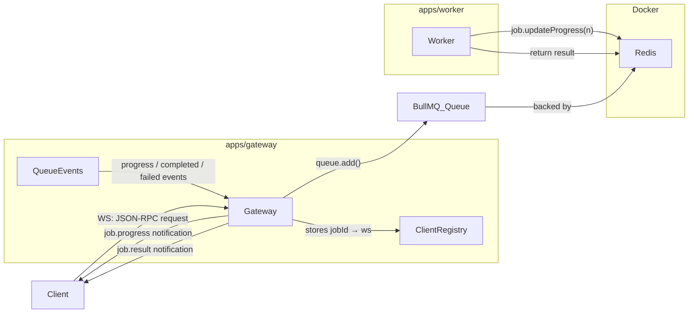
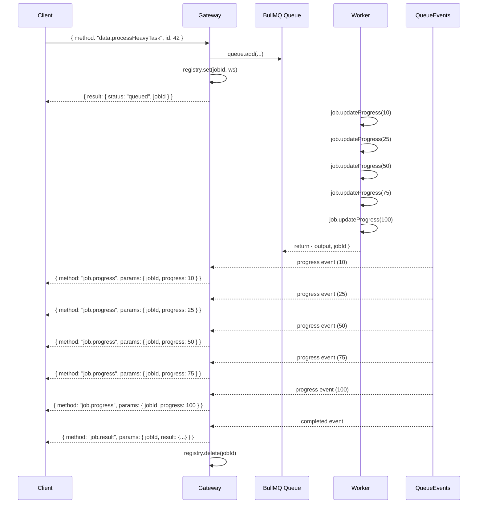

# Design Document: job-progress-updates

## Overview

This feature adds live job progress updates to the existing real-time async backend. The BullMQ worker emits progress milestones (10%, 25%, 50%, 75%, 100%) during job processing and returns a result on completion. The gateway subscribes to BullMQ `QueueEvents` over Redis pub/sub and forwards progress and result notifications to the correct WebSocket client using an in-memory client registry.

The existing stack is unchanged:
- **Runtime**: Bun
- **Gateway**: `apps/gateway/index.ts` — `Bun.serve()` on port 4000
- **Worker**: `apps/worker/index.ts` — BullMQ `Worker` consuming the `"jobs"` queue
- **Queue/Events**: BullMQ over IORedis (Redis via Docker)
- **Protocol**: JSON-RPC 2.0 over WebSocket

---

## Architecture



Message flow:

1. Client sends a JSON-RPC 2.0 request over WebSocket.
2. Gateway enqueues the job, stores `jobId → ws` in the Client Registry, and sends a `{ status: "queued", jobId }` ack.
3. Worker picks up the job, calls `job.updateProgress()` at each milestone, and returns a result.
4. BullMQ publishes `progress` and `completed` events to Redis pub/sub.
5. Gateway's `QueueEvents` listener receives each event, looks up the WebSocket in the Client Registry, and sends a JSON-RPC 2.0 notification.
6. On `completed` (or `failed`), the Client Registry entry is removed.



---

## Components and Interfaces

### Worker (`apps/worker/index.ts`)

The worker processor is extended to simulate multi-step work and emit progress at each milestone before returning a result.

```typescript
new Worker("jobs", async (job) => {
  await job.updateProgress(10);
  // ... step 1 ...
  await job.updateProgress(25);
  // ... step 2 ...
  await job.updateProgress(50);
  // ... step 3 ...
  await job.updateProgress(75);
  // ... step 4 ...
  await job.updateProgress(100);
  const output = `Processed: ${job.data?.params?.input ?? job.id}`;
  return { output, jobId: job.id };
}, { connection });
```

### Gateway — Client Registry (`apps/gateway/index.ts`)

An in-memory `Map<string, WebSocket>` keyed by `jobId`. Lifecycle:

- **Set**: immediately after `queue.add()` returns a job ID.
- **Delete on close**: in `websocket.close`, iterate the registry and remove all entries whose value is the closing socket.
- **Delete on completion/failure**: in the `QueueEvents` `completed` and `failed` handlers.

```typescript
const clientRegistry = new Map<string, any>(); // jobId → ws

// On enqueue:
clientRegistry.set(job.id!, ws);

// On ws close:
for (const [jobId, socket] of clientRegistry) {
  if (socket === ws) clientRegistry.delete(jobId);
}

// On completed/failed:
clientRegistry.delete(jobId);
```

### Gateway — QueueEvents Listener (`apps/gateway/index.ts`)

A single `QueueEvents` instance is created at module level, connected to the same Redis instance and `"jobs"` queue.

```typescript
import { QueueEvents } from "bullmq";

const queueEvents = new QueueEvents("jobs", { connection });

queueEvents.on("progress", ({ jobId, data }) => {
  const ws = clientRegistry.get(jobId);
  if (!ws) return; // silently discard
  ws.send(JSON.stringify({
    jsonrpc: "2.0",
    method: "job.progress",
    params: { jobId, progress: data },
  }));
});

queueEvents.on("completed", ({ jobId, returnvalue }) => {
  const ws = clientRegistry.get(jobId);
  if (ws) {
    ws.send(JSON.stringify({
      jsonrpc: "2.0",
      method: "job.result",
      params: { jobId, result: returnvalue },
    }));
  }
  clientRegistry.delete(jobId);
});

queueEvents.on("failed", ({ jobId, failedReason }) => {
  const ws = clientRegistry.get(jobId);
  if (ws) {
    ws.send(JSON.stringify({
      jsonrpc: "2.0",
      method: "job.failed",
      params: { jobId, error: failedReason },
    }));
  }
  clientRegistry.delete(jobId);
});

queueEvents.on("error", (err) => {
  console.error("QueueEvents Redis error:", err);
});
```

---

## Data Models

### Progress Message (outbound WebSocket notification)

```typescript
interface ProgressMessage {
  jsonrpc: "2.0";
  method: "job.progress";
  params: {
    jobId: string;
    progress: 10 | 25 | 50 | 75 | 100;
  };
  // no "id" field — this is a notification
}
```

### Result Message (outbound WebSocket notification)

```typescript
interface ResultMessage {
  jsonrpc: "2.0";
  method: "job.result";
  params: {
    jobId: string;
    result: unknown; // the value returned by the worker
  };
  // no "id" field — this is a notification
}
```

### Failure Message (outbound WebSocket notification)

```typescript
interface FailureMessage {
  jsonrpc: "2.0";
  method: "job.failed";
  params: {
    jobId: string;
    error: string; // failedReason from BullMQ
  };
  // no "id" field — this is a notification
}
```

### Worker Return Value

```typescript
interface WorkerResult {
  output: string;  // processed output string
  jobId: string;   // the BullMQ job ID
}
```

### Client Registry Entry

```typescript
// Map<jobId: string, ws: BunWebSocket>
const clientRegistry = new Map<string, any>();
```

---

## Correctness Properties

*A property is a characteristic or behavior that should hold true across all valid executions of a system — essentially, a formal statement about what the system should do. Properties serve as the bridge between human-readable specifications and machine-verifiable correctness guarantees.*

### Property 1: Worker emits milestones in order

*For any* job processed by the worker, `job.updateProgress` shall be called exactly five times with the values `[10, 25, 50, 75, 100]` in that order before the processor returns.

**Validates: Requirements 1.1, 1.2, 1.3, 1.4, 1.5**

### Property 2: Worker result contains output and jobId

*For any* job with any input data, the value returned by the worker processor shall be an object containing a non-empty `output` string and a `jobId` string equal to the job's ID.

**Validates: Requirements 1.6**

### Property 3: Registry stores and retrieves jobId-to-ws mappings

*For any* set of (jobId, ws) pairs, after storing them in the Client Registry, each jobId shall map to its corresponding ws and entries for different jobs shall not interfere with each other.

**Validates: Requirements 2.1, 2.3**

### Property 4: Registry cleanup on WebSocket close

*For any* WebSocket connection that has one or more jobId entries in the Client Registry, when that connection closes, all entries associated with that connection shall be removed from the registry.

**Validates: Requirements 2.2**

### Property 5: Progress message shape

*For any* progress event with any jobId and any progress value, the message sent to the client shall be a valid JSON-RPC 2.0 notification with `method === "job.progress"`, `params.jobId` equal to the event's jobId, `params.progress` equal to the event's progress value, and no `id` field.

**Validates: Requirements 4.1, 4.2, 4.5**

### Property 6: Result message shape

*For any* completion event with any jobId and any return value, the message sent to the client shall be a valid JSON-RPC 2.0 notification with `method === "job.result"`, `params.jobId` equal to the event's jobId, `params.result` equal to the return value, and no `id` field.

**Validates: Requirements 4.3, 4.4, 4.5**

### Property 7: Progress routing — known jobId delivers, unknown jobId discards

*For any* progress event, if the jobId is present in the Client Registry then `ws.send` shall be called exactly once with a correctly shaped Progress_Message; if the jobId is absent from the registry then `ws.send` shall not be called and no error shall be thrown.

**Validates: Requirements 3.2, 3.3, 3.4**

### Property 8: Completion event triggers result send and registry cleanup

*For any* completion event where the jobId is present in the Client Registry, the gateway shall send a Result_Message to the associated ws and then remove the jobId from the registry, so that subsequent events for the same jobId are silently discarded.

**Validates: Requirements 3.5, 3.6**

### Property 9: Result message is sent only on completed event, not on progress(100)

*For any* job, the gateway's progress event handler shall never send a `"job.result"` notification, and the gateway's completed event handler shall always send a `"job.result"` notification (when a matching ws exists).

**Validates: Requirements 5.3**

### Property 10: Failure message shape and registry cleanup

*For any* failed event where the jobId is present in the Client Registry, the gateway shall send a JSON-RPC 2.0 notification with `method === "job.failed"`, `params.jobId` equal to the event's jobId, `params.error` equal to the failure reason string, and then remove the jobId from the registry.

**Validates: Requirements 6.1, 6.2**

---

## Error Handling

| Scenario | Behavior |
|---|---|
| Progress event for unknown jobId | Silently discard — no send, no error thrown |
| Completion event for unknown jobId | Remove from registry (no-op), no send |
| Failed event for unknown jobId | Remove from registry (no-op), no send |
| WebSocket closes mid-job | Registry entries for that ws are removed; subsequent events are silently discarded |
| `ws.send()` throws (socket already closed) | Catch and log; remove jobId from registry |
| QueueEvents Redis connection error | Log via `queueEvents.on("error", ...)` handler; IORedis retries automatically per existing config |
| Worker processor throws | BullMQ marks job as failed; gateway receives `failed` event and notifies client |

---

## Testing Strategy

### Dual Testing Approach

Both unit tests and property-based tests are used. Unit tests cover specific examples, configuration assertions, and edge cases. Property tests verify universal correctness across randomized inputs.

### Property-Based Testing

Library: **fast-check** (TypeScript-native, works with Bun's test runner).

Each property test runs a minimum of **100 iterations**.

Each test is tagged with a comment in the format:
`// Feature: job-progress-updates, Property <N>: <property text>`

| Property | Test description | fast-check arbitraries |
|---|---|---|
| Property 1 | Run worker processor with random job data; assert `updateProgress` call sequence is `[10,25,50,75,100]` | `fc.record({ id: fc.string(), data: fc.anything() })` |
| Property 2 | Run worker processor with random job; assert return value has `output: string` and `jobId === job.id` | Same as above |
| Property 3 | Insert random (jobId, ws) pairs into registry; assert each lookup returns the correct ws | `fc.array(fc.tuple(fc.string(), fc.object()))` |
| Property 4 | Insert multiple jobIds for a ws; simulate close; assert all entries removed | `fc.array(fc.string())` for jobIds |
| Property 5 | Generate random jobId + progress value; call progress handler; assert sent message shape | `fc.record({ jobId: fc.string(), data: fc.integer({ min: 0, max: 100 }) })` |
| Property 6 | Generate random jobId + returnvalue; call completed handler; assert sent message shape | `fc.record({ jobId: fc.string(), returnvalue: fc.anything() })` |
| Property 7 | Generate progress events with jobIds both in and not in registry; assert send called iff jobId present | `fc.record({ jobId: fc.string(), data: fc.integer() })` |
| Property 8 | Generate completion events with jobId in registry; assert send called then registry entry removed | `fc.record({ jobId: fc.string(), returnvalue: fc.anything() })` |
| Property 9 | Generate progress events including progress=100; assert progress handler never sends `job.result` | `fc.record({ jobId: fc.string(), data: fc.constant(100) })` |
| Property 10 | Generate failed events with jobId in registry; assert failure notification shape and registry cleanup | `fc.record({ jobId: fc.string(), failedReason: fc.string() })` |

### Unit Tests (Examples)

- `QueueEvents` is constructed with queue name `"jobs"` and the shared Redis connection (Requirement 3.1)
- Registry correctly handles the case where the same ws has multiple jobIds (Requirement 2.3)
- Progress event for a jobId not in the registry does not throw (Requirement 3.4 edge case)
- WebSocket close with no registry entries does not throw (Requirement 2.2 edge case)
- `queueEvents.on("error", ...)` handler is registered (Requirement 6.4)

### Test File Layout

```
apps/worker/
  __tests__/
    worker.progress.test.ts   # Property tests for Properties 1, 2

apps/gateway/
  __tests__/
    registry.test.ts          # Property tests for Properties 3, 4
    queue-events.test.ts      # Property tests for Properties 5, 6, 7, 8, 9, 10
    gateway.unit.test.ts      # Unit tests for configuration and edge cases
```
