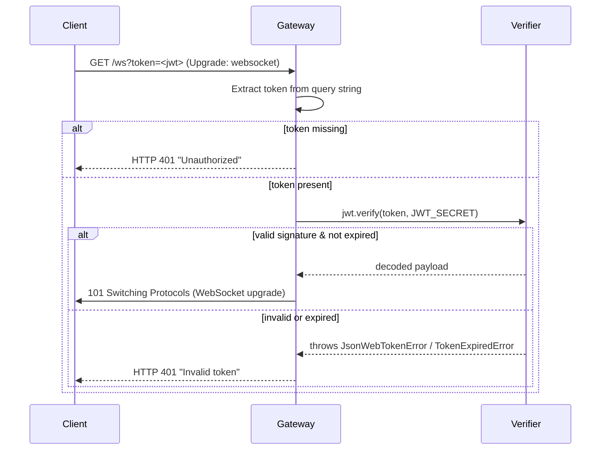
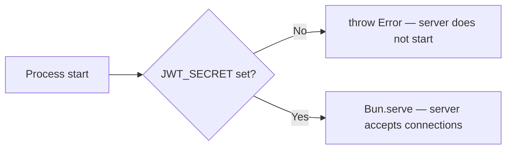

# Design Document: JWT Gateway Auth

## Overview

This feature adds cryptographic JWT verification to the Bun WebSocket gateway (`apps/gateway/index.ts`). Currently the gateway checks only for the presence of a `token` query parameter but does not validate it. After this change, the gateway will use the `jsonwebtoken` library to verify the token's signature and expiry against a secret loaded from `JWT_SECRET` at startup. Connections with missing or invalid tokens are rejected with HTTP 401 before the WebSocket upgrade occurs.

The change is intentionally minimal: a single verification step is inserted into the existing `fetch` handler's `/ws` branch, and a startup guard ensures the secret is present before the server begins accepting connections.

## Architecture

The gateway is a single-process Bun server. JWT verification is a synchronous gate in the HTTP upgrade path — no new processes, queues, or external services are introduced.



Startup guard:



## Components and Interfaces

### Startup Guard

Executed once before `Bun.serve` is called.

```typescript
const JWT_SECRET = process.env.JWT_SECRET;
if (!JWT_SECRET) {
  throw new Error("JWT_SECRET environment variable is required");
}
```

### Token Verifier

A thin wrapper around `jsonwebtoken.verify` used inside the `fetch` handler.

```typescript
import jwt from "jsonwebtoken";

function verifyToken(token: string): boolean {
  try {
    jwt.verify(token, JWT_SECRET);
    return true;
  } catch {
    return false;
  }
}
```

### Modified fetch Handler (`/ws` branch)

```typescript
if (url.pathname === "/ws") {
  const token = url.searchParams.get("token");
  if (!token) {
    return new Response("Unauthorized", { status: 401 });
  }
  if (!verifyToken(token)) {
    return new Response("Invalid token", { status: 401 });
  }
  const upgraded = server.upgrade(req);
  if (upgraded) return undefined as any;
  return new Response("WebSocket upgrade failed", { status: 500 });
}
```

No other parts of the gateway (WebSocket message handling, BullMQ queue, Redis connection) are changed.

## Data Models

### JWT Payload

The gateway does not impose any application-specific claims beyond the standard ones validated by `jsonwebtoken`:

| Field | Type | Description |
|-------|------|-------------|
| `exp` | number (Unix timestamp) | Optional expiry — if present, token is rejected after this time |
| `iat` | number (Unix timestamp) | Optional issued-at |
| *(any)* | any | Additional claims are accepted but ignored |

The algorithm is HS256 (HMAC-SHA256), which is the `jsonwebtoken` default for string secrets.

### Environment Variables

| Variable | Required | Description |
|----------|----------|-------------|
| `JWT_SECRET` | Yes | Secret used to verify HS256 token signatures. Must be set before startup. |

### Dependency Addition

`apps/gateway/package.json` gains:

```json
"jsonwebtoken": "latest",
"@types/jsonwebtoken": "latest"
```


## Correctness Properties

*A property is a characteristic or behavior that should hold true across all valid executions of a system — essentially, a formal statement about what the system should do. Properties serve as the bridge between human-readable specifications and machine-verifiable correctness guarantees.*

### Property 1: Missing token yields 401 Unauthorized

*For any* WebSocket upgrade request that omits the `token` query parameter, the gateway shall return HTTP 401 with body `"Unauthorized"` and shall not perform the WebSocket upgrade.

**Validates: Requirements 1.1**

### Property 2: Valid token allows upgrade

*For any* JWT signed with the correct `JWT_SECRET` and not yet expired, the gateway shall not return a 401 response and shall proceed with the WebSocket upgrade.

**Validates: Requirements 2.2, 5.4**

### Property 3: Invalid signature yields 401 Invalid token

*For any* token string whose HMAC-SHA256 signature does not match the `JWT_SECRET` (e.g., signed with a different secret, or manually tampered), the gateway shall return HTTP 401 with body `"Invalid token"` and shall not perform the WebSocket upgrade.

**Validates: Requirements 2.3, 5.5**

### Property 4: Expired token yields 401 Invalid token (edge case)

*For any* JWT that is structurally valid and correctly signed but whose `exp` claim is in the past, the gateway shall return HTTP 401 with body `"Invalid token"` and shall not perform the WebSocket upgrade.

**Validates: Requirements 2.4**

## Error Handling

| Condition | Response | Notes |
|-----------|----------|-------|
| `token` query param absent | HTTP 401 `"Unauthorized"` | Before any JWT parsing |
| Token present but signature invalid | HTTP 401 `"Invalid token"` | `JsonWebTokenError` from `jsonwebtoken` |
| Token present but expired | HTTP 401 `"Invalid token"` | `TokenExpiredError` from `jsonwebtoken` |
| `JWT_SECRET` not set at startup | `throw new Error(...)` — process exits | Checked synchronously before `Bun.serve` |
| WebSocket upgrade fails (non-auth reason) | HTTP 500 `"WebSocket upgrade failed"` | Existing behaviour, unchanged |

All JWT errors are caught in a single `try/catch` around `jwt.verify`. Both `JsonWebTokenError` and `TokenExpiredError` map to the same `"Invalid token"` response, so the client receives no information about which check failed.

## Testing Strategy

### Unit Tests

Focus on specific examples and edge cases:

- Startup throws when `JWT_SECRET` is missing (example — Requirement 2.5)
- `.env.example` contains a `JWT_SECRET` entry (example — Requirement 3.2)
- `apps/gateway/package.json` lists `jsonwebtoken` as a dependency (example — Requirement 4.1/4.2)
- `verifyToken` returns `false` for an expired token (edge case — Requirement 2.4)
- `verifyToken` returns `false` for a token signed with the wrong secret (edge case — Requirement 2.3)
- `verifyToken` returns `true` for a freshly signed valid token (example — Requirement 2.2)

### Property-Based Tests

Use a property-based testing library (e.g., `fast-check` for TypeScript/Bun) with a minimum of **100 iterations** per property.

Each test is tagged with the format: `Feature: jwt-gateway-auth, Property <N>: <property_text>`

**Property 1 — Missing token → 401 Unauthorized**
```
// Feature: jwt-gateway-auth, Property 1: Missing token yields 401 Unauthorized
// For any request path/query string that omits the token param,
// the fetch handler returns 401 "Unauthorized" without upgrading.
fc.assert(fc.asyncProperty(fc.string(), async (randomPath) => {
  const req = new Request(`http://localhost:4000/ws`); // no ?token=
  const response = await handleFetch(req, mockServer);
  return response.status === 401 && (await response.text()) === "Unauthorized";
}), { numRuns: 100 });
```

**Property 2 — Valid token → upgrade proceeds**
```
// Feature: jwt-gateway-auth, Property 2: Valid token allows upgrade
// For any payload object, a token signed with JWT_SECRET should not produce a 401.
fc.assert(fc.asyncProperty(fc.record({ sub: fc.string(), iat: fc.integer() }), async (payload) => {
  const token = jwt.sign(payload, JWT_SECRET);
  const req = new Request(`http://localhost:4000/ws?token=${token}`);
  const response = await handleFetch(req, mockServer);
  return response === undefined || response.status !== 401;
}), { numRuns: 100 });
```

**Property 3 — Invalid signature → 401 Invalid token**
```
// Feature: jwt-gateway-auth, Property 3: Invalid signature yields 401 Invalid token
// For any token signed with a different secret, the handler returns 401 "Invalid token".
fc.assert(fc.asyncProperty(fc.string({ minLength: 1 }), async (wrongSecret) => {
  fc.pre(wrongSecret !== JWT_SECRET);
  const token = jwt.sign({ sub: "user" }, wrongSecret);
  const req = new Request(`http://localhost:4000/ws?token=${token}`);
  const response = await handleFetch(req, mockServer);
  return response.status === 401 && (await response.text()) === "Invalid token";
}), { numRuns: 100 });
```

### Manual Testing Guide

**Generate a valid token** (Node.js / Bun REPL):
```js
import jwt from "jsonwebtoken";
import { config } from "dotenv";
config();
const token = jwt.sign({ sub: "dev" }, process.env.JWT_SECRET, { expiresIn: "1h" });
console.log(token);
```

**Connect with a valid token** (wscat):
```bash
wscat -c "ws://localhost:4000/ws?token=<paste_token_here>"
# Expected: connection accepted, prompt appears
```

**Connect with an invalid token**:
```bash
wscat -c "ws://localhost:4000/ws?token=invalid.token.value"
# Expected: HTTP 401 — connection rejected before handshake
```

**Connect with no token**:
```bash
wscat -c "ws://localhost:4000/ws"
# Expected: HTTP 401 "Unauthorized"
```
