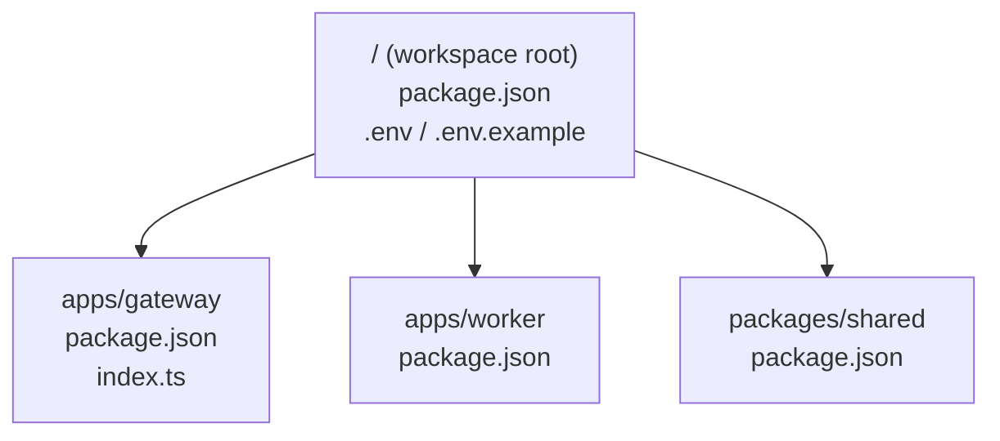
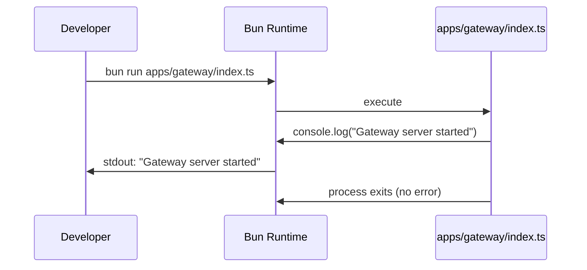

# Design Document: Real-Time Async Service Backend (Foundation/Setup)

## Overview

This document describes the technical design for the foundation/setup stage of the Real-Time Async Service Backend. The goal is to scaffold a Bun-based monorepo with three packages — `apps/gateway`, `apps/worker`, and `packages/shared` — along with environment configuration and a minimal Gateway entry point. No business logic is implemented at this stage; the design focuses entirely on project structure, dependency declarations, and startup verification.

The stack is:
- **Runtime**: Bun (monorepo workspaces)
- **HTTP/WS framework**: Fastify + @fastify/websocket (Gateway)
- **Queue**: BullMQ over IORedis
- **Validation**: Zod
- **Config**: `.env` / `.env.example` at workspace root

---

## Architecture

The monorepo follows a standard Bun workspace layout. Each app and package is independently versioned and can declare its own dependencies. At this stage there is no inter-package dependency (shared is declared but not yet imported by gateway/worker).



At runtime (future stages), the Gateway will accept HTTP and WebSocket connections, enqueue jobs via BullMQ, and the Worker will consume those jobs. For this stage, only the Gateway entry point is exercised.



---

## Components and Interfaces

### Workspace Root

- `package.json` — declares `workspaces: ["apps/*", "packages/*"]` and any root-level dev tooling
- `.env` — runtime secrets and config values
- `.env.example` — template with the same keys, safe to commit

### apps/gateway

- `package.json` — declares dependencies: `fastify`, `@fastify/websocket`, `zod`, `ioredis`, `bullmq`
- `index.ts` — minimal entry point; prints startup message and exits cleanly

### apps/worker

- `package.json` — declares dependencies: `bullmq`, `ioredis`, `zod`

### packages/shared

- `package.json` — declares dependencies: `zod`; `name` field set to a resolvable package name (e.g. `@repo/shared`) for future cross-package imports

---

## Data Models

### Environment Configuration

The `.env` file defines the following key-value pairs:

| Variable     | Example Value | Description                        |
|--------------|---------------|------------------------------------|
| `PORT`       | `3000`        | HTTP port for the Gateway server   |
| `REDIS_HOST` | `localhost`   | Hostname of the Redis instance     |
| `REDIS_PORT` | `6379`        | Port of the Redis instance         |
| `JWT_SECRET` | `secret`      | Secret used for JWT signing/verify |

`.env.example` mirrors these keys with the same (or equivalent example) values and is committed to source control. `.env` is gitignored.

### package.json Shapes

Each workspace member's `package.json` must include at minimum:

```jsonc
// apps/gateway/package.json
{
  "name": "gateway",
  "version": "1.0.0",
  "dependencies": {
    "fastify": "...",
    "@fastify/websocket": "...",
    "zod": "...",
    "ioredis": "...",
    "bullmq": "..."
  }
}
```

```jsonc
// apps/worker/package.json
{
  "name": "worker",
  "version": "1.0.0",
  "dependencies": {
    "bullmq": "...",
    "ioredis": "...",
    "zod": "..."
  }
}
```

```jsonc
// packages/shared/package.json
{
  "name": "@repo/shared",
  "version": "1.0.0",
  "dependencies": {
    "zod": "..."
  }
}
```

---

